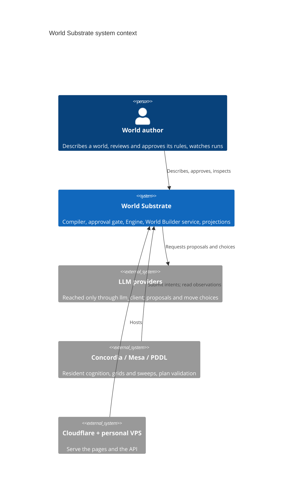
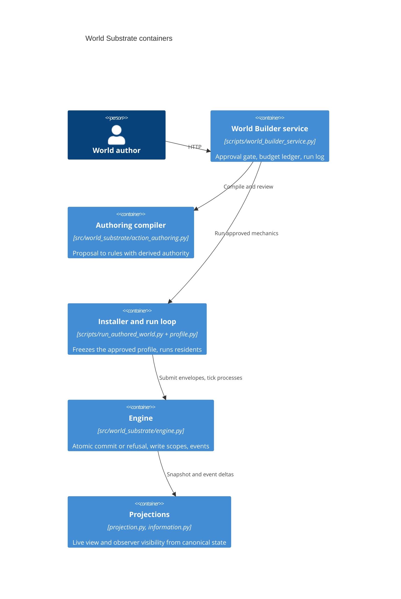

# World Substrate as a software system: an ODD-style model

Status: implemented-system description at commit `d18ead6` (2026-10-06); the any-scenario pipeline, information items and linked process participants added at `2e409ab` (2026-10-08). It describes what the code does, not target architecture. Machine-readable twin: [world_substrate_model.toml](world_substrate_model.toml), checked against the code by `tests/test_system_model.py`. What each view shows of this model: [VIEW_COVERAGE.md](VIEW_COVERAGE.md).

**Two levels, kept apart.** World Substrate *hosts* world models: Kitchen, Orchard, Repair Bay, Waltzman, each with its own entities, rules and outcomes. This document is **not** about any of those worlds. It models the *software system that holds them*: what it stores (worlds, rule proposals, approvals, runs, logs), the processes that change what it stores, and the records each process writes. A "rule" below is a stored object the system compiles and enforces; what a particular rule means inside a particular world is out of scope.

The format follows ODD (Overview, Design concepts, Details), the standard protocol for describing agent-based models, applied here to the system rather than to a simulated world.

## 1. Purpose and the questions the system answers

**Purpose.** Let a person describe a small world in plain words, get a proposed set of executable rules, check and approve them, and then watch a fresh simulation in which only those approved rules decide what happens, with a recorded reason for every outcome. Decision 006 narrows the product to this **governed-rules layer**: rules as data -> compiler-derived authority -> explicit human approval -> atomic commit or refusal with recorded cause, plus the authoring and review path that produces those rules.

Questions the system is built to answer, for a person or an investigating agent:

1. What exists in this world, and what may each actor try? (bundle, offered actions)
2. Exactly which rules will run, what may each one read and write, and what limits does it carry? (causal review)
3. Did a person approve these rules before they ran? (approval gate)
4. For any attempt: was it allowed or refused, and which check decided it? (engine event status and checks)
5. What changed in the world, and what changed by itself (processes) rather than by an actor? (event changes, `world_changes`)
6. Which exact law ran? (frozen mechanic profile id, world fingerprint)
7. What happened in a visitor's session, what did it cost, and what failed? (run log, budget ledger)
8. What changes if one parameter changes? (native-coordination comparison)
9. For a scenario described in plain words (any-scenario pipeline): what conceptual model was written, which checks failed and which repairs were kept, what each resident believed, attempted and expected, and which rules were written mid-run? (`model.json`, `checks.json`, `attempts.jsonl`, `summary.json`)
10. Which kinds of things can a world represent at all, and which path can produce each? (section 4.1)

## 2. Expected observable patterns (if the system works)

Each pattern is something a check or a person could observe. VIEW_COVERAGE.md records where a view breaks one.

| # | Pattern | Where it is observable |
| --- | --- | --- |
| P1 | Every submitted attempt produces exactly one Engine event and one command; commands replay to identical statuses. | `World.events`, `World.commands`, `Engine.replay_commands` (`src/world_substrate/engine.py:879`) |
| P2 | A refused attempt leaves `hash_before == hash_after` and the revision unchanged. | event `changes` empty; `hash_*` (`engine.py:505-545`) |
| P3 | `revision` rises by exactly one per committed event; `tick` rises by one per round. | `engine.py:667`, `:842`, `advance` |
| P4 | No `/run` or `/compare-native-coordination` executes without `approved: true`; every `/run` recompiles the causal model before any policy or model call. | HTTP 409 (`scripts/world_builder_service.py:998-1000`); compile at `:1006` |
| P5 | Causal-model action kinds equal the bundle's action kinds, exactly. | `src/world_substrate/action_authoring.py:383-391` |
| P6 | A continued round uses the same law: world identity and rule versions match. | `scripts/run_authored_world.py:233-242` |
| P7 | Every logged request leaves one run-log line; LLM spend never exceeds the day's cap. | `runs_<date>.jsonl`; budget ledger (`world_builder_service.py:183-220`) |
| P8 | Presentation never writes canonical state; two renders of the same projection give the same logical frames. | `living_scene.py` frame builder; renderers read-only |
| P9 | Counts a view prints equal counts of the model element they name (allowed = accepted events; refused = refused attempts). | home outcome line (refused = submitted attempts that did not go through; held back by the rules counted separately; fixed 2026-10-06, see G2) |

## 3. Boundary

**Context (C4 level 1).** The rules each process enforces, with their owner files and tests, are in [trace.yaml](trace.yaml).

**Containers (C4 level 2).**

**Inside World Substrate** (Decision 006):

- Authoring structure: description, dialogue helper, authoring bundle, native-coordination draft.
- Rule proposals as data (`world-substrate-causal-model/v0`), the local compiler, the installer and the frozen mechanic profile.
- The approval gate.
- The Engine: one canonical world per run, atomic commit or refusal, declared write scopes enforced, read scopes recorded, causal events.
- The run loop that offers actions, takes one choice per actor per round and advances processes; the read-only projections and existing renderers; the World Builder pages and API; run log and budget ledger.
- Information items and their per-recipient delivery (`src/world_substrate/information.py`), applied by `Engine.observe` to every world.
- The describe-any-scenario pipeline spike (`spikes/any-scenario-2026-10/`, [Decision 007](../decisions/007-any-scenario-path.md)): offline scripts that reuse the World Builder generators, compiler and Engine. Not deployed; nothing on the World Builder path calls it. Its residents run on Concordia (`gdm-concordia==2.4.0`), which is outside.

**Outside** (hosted on commodity runtimes, or simply not ours):

- LLM providers, reached only through the shared `llm_client` (proposal and move selection only, never state).
- Any new engine, scheduler, renderer or resident-cognition capability: Decision 006 routes those to Concordia (LLM residents), Mesa (grids, sweeps) or a PDDL export (validation). Existing native pieces (integer-tick loop, Living Scene renderer, replay) are maintained, not extended.
- Hosting: Cloudflare serves the pages; the personal VPS runs the API.
- Donor systems (Cybernetic Influence, the `/waltzman/` donor surface) and consumers (agent_ecology3 pins this repo for its Living view).
- What any hosted world *means*: whether its rules are true of the real world (root `AGENTS.md`, causal claim boundary).

## 4. Entities and their state

Full field lists with sources are in the model file's `[[entities]]`. In plain words:

| Entity | What it is | State that matters |
| --- | --- | --- |
| Description | the words a person writes | text, world kind (task / ongoing) |
| AuthoringBundle | what exists: world, components, entities, action signatures, presentation | represented structure only, no law |
| CausalModel | proposed law: one mechanic per action kind, up to 6 processes, optional finish line | checks, effects, selectors, terminal |
| CausalReview | what the compiler says that law may touch | derived reads, writes, limits, tests |
| MechanicProfile | the installed, validated set of rules for one run | packages, findings, frozen id |
| Approval | a person's yes | a boolean in page state and in the request; not stored as a record |
| World | the one canonical world during a run | identity, tick, revision, entities, commands, events |
| Entity | a thing or actor inside a World | typed components, location, last cause event |
| Snapshot | a copy of a World's material state | no commands, no events |
| Run | one execution: the contested-run trace | profile id, summary, per-round transcript, final snapshot |
| LiveProjection | initial snapshot + canonical events for one branch | replay-checked final state and hash |
| SceneProfile / LivingSceneFrame | presentation declaration and the frames computed from it | zones, anchors, event visuals; per-boundary views |
| Comparison | a native-coordination what-if | baseline, one changed parameter, comparison run |
| Draft | native-coordination one-shot draft and its review | bounded intent review |
| RunLogEntry | one line per logged request | who, what, result summary, cost, errors |
| BudgetLedger | spent and reserved LLM dollars today | fails closed when unreadable |
| Job | an in-memory background request | lost on restart |
| InformationItem | a represented piece of information (`information` component) | content, source, channel, visibility, active |
| Delivery | one item's delivery to one recipient (`delivery` component) | info id, recipient, status, delivered tick |
| OddModel | the pipeline's conceptual model of a scenario (ODD) | entities with quantitative state, per-tick processes, decisions, sensing, stocks, assumptions |
| ScenarioModel | `model.json`: what the modeling step decided | scenario text, ODD, stock map, repairs, final check counts, not-modeled list, trace ids |
| SensingMap | `sensing.json`: per actor, the fields it can observe | enforced by the run script, not the Engine |
| StockFlows | `flows.json`: every numeric field with the rules that raise, lower or set it | derived, no LLM |
| CheckReport | `checks.json`: layer-1 checks by simulation | findings (blocking / advisory) per check |
| RuleChange | 1-3 rule changes an LLM proposes, compiled before use | repair rounds (kept or reverted), mid-run rules or rulings |
| Resident | one Concordia LLM agent per actor | last 6 observations, scenario briefing; in memory only |
| Attempt | one resident decision (`attempts.jsonl` row) | belief, cited observations, decision, expected and observed effect, what was performed |
| ScenarioRun | one pipeline run folder | events, attempts, ticks, final view, summary, after-run rules |

`CausalModel` processes may also name **linked participants** (`DeclaredProcess.participants`, `src/world_substrate/action_authoring.py:264`, PR #136): extra entities resolved from the matching entity `it` by a link (`owner_of_it`, `owned_by_it`, `co_located`, or `ref:<component>.<field>`; `PROCESS_LINKS`, `:669`), so one process event can change `it` and the linked entities together (a driver moving with the vehicle). Each combination of linked entities is one binding (`_link_bindings`, `:733`); if any link resolves to nothing, the process does not apply to that `it`. Link reads are derived like any other read (`_link_reads`, `:696`).

### 4.1 Kinds of things a world can represent, and which path can produce each

The machine-readable twin is `[[world_kinds]]` in the model file (the test checks every row gives every path). "Fixed template" means the path only fills a fixed shape.

| Kind | World Builder generators | Native-coordination draft | Any-scenario pipeline | Hand-authored reference worlds |
| --- | --- | --- | --- | --- |
| Entity with typed components | yes (bundle `components`, `scripts/scaffold_world.py:56`) | fixed template | yes (same bundle generator) | yes (`register_component`, e.g. `reference_worlds/waltzman/components.py:58`) |
| Action (checks + effects) | yes | fixed template (`examples/native_coordination/coordination-causal-v0.json`, 4 mechanics) | yes | yes (Python mechanics) |
| Process (the world changes by itself) | yes | no (the fixed causal model has 0 processes) | yes | yes (Python processes, e.g. `reference_worlds/workshop/probe.py:39`) |
| Process with linked participants | yes (offered in the process schema, `scripts/generate_causal_model.py:266`) | no | yes (evidence `evidence/linked/`) | no (Python mechanics write what they like; the declared form is not used) |
| Relationship, as an `entity_ref` field or `owner_ref` | yes (`scripts/generate_world_bundle.py:53`, `:56`) | fixed template | yes | yes |
| Information item + per-recipient delivery | no | fixed template (`scripts/native_coordination_authoring.py:91`, `:519`) | no | yes (Waltzman, `reference_worlds/waltzman/mechanics.py:198`) |
| Per-actor sensing map (field-level observation filter) | no | no | yes (`sensing.json`, applied in `run_scenario.py`) | no |
| Person with a behavioral profile | no | no | no | no |
| Scheduled moment | no | no | no | no |

So a world the any-scenario pipeline generates contains **only entities with components, plus actions and processes** (and a terminal): its actors are entities with the `actor` category and world-local components (for example Waltzman's `governance_participant`), and its residents are briefed with the scenario text alone. There is **no person-with-profile kind and no information-item kind** in it: neither generator mentions information items, and no pipeline file uses `information.py`. `information.py` provides information items to worlds that are written by hand (Waltzman) or filled from the fixed native-coordination template. Whatever path built a world, `Engine.observe` shows an actor only entities at its own location (or itself), and among those hides an `information` entity until it is delivered to that actor or public, and a `delivery` entity from everyone but its recipient and the item's source (`engine.py:235-262`, `information.py:57-102`).

### 4.2 Comparison with donor schemas

Cybernetic Influence v3's world schema, `GeneralSimulationProposalV1` (`cybernetic_influence_v3/src/cybernetic_influence/general_simulation/authoring_models.py:284`, read at `16b1791`), against what World Substrate holds:

| Donor kind | Donor field | World Substrate | Where |
| --- | --- | --- | --- |
| People with behavioral profiles (values, goals, beliefs, decision tendencies, social perceptions, current state, capabilities, limitations; plus position, disposition, memories) | `people: GeneralPersonDraft` (`:38`, profile `:25`) | **Lacks.** An actor is an entity with the `actor` category and components; pipeline residents get the scenario text as their only briefing (`run_scenario.py:119-129`); Waltzman's `ResidentState` is role + organization (`reference_worlds/waltzman/components.py:11`). | — |
| World records with public and hidden state and an actor visibility list | `world_records` (`:52`) | **Partly.** Entities with components are the records, but there is no per-field hidden state and no visibility list. Visibility is co-location (`Engine.observe`), information delivery, and in the pipeline a per-actor field list enforced by the run script. | `engine.py:235`, `information.py:95`, `run_scenario.py:210-211` |
| Information representations with recipients and hidden provenance | `information_extension.representations` (`:113`) | **Has, for hand-authored and template worlds; no hidden provenance.** `InformationState` (content, source, channel, visibility, topic, `derived_from_info_id`, active) plus one `DeliveryState` per recipient. Not produced by the World Builder generators or the pipeline. | `information.py:21`, `:34` |
| Sensing rules (an observer reveals hidden keys of a subject into an output record for recipients) | `sensing_rules` (`:156`) | **Partly.** No sensing rule or hidden keys. The pipeline's `sensing.json` is a static per-actor list of observable fields, mapped by an LLM from the ODD and applied by `run_scenario.py`, not by the Engine. | `model_scenario.py:110`, `run_scenario.py:210` |
| Scheduled moments (minute, injects, active components) | `schedule` (`:147`) | **Lacks.** Time is an integer tick; processes apply every tick their checks hold; the generic future-event scheduler is not integrated (root `AGENTS.md`). | — |
| Relationships (two or more participants with a description) | `relationship_extension` (`:136`) | **Partly.** No relationship kind. `entity_ref` fields and `owner_ref` link entities, and linked process participants follow those links (`owner_of_it`, `owned_by_it`, `co_located`, `ref:`). | `action_authoring.py:669-741` |
| Coverage report (per requested behavior: exact / coarse / descriptive / unsupported, with compiler evidence) | `ExecutionCoverageReportV1` (`:477`) | **Partly.** No per-request coverage classification. The nearest are the compiler-derived `CausalReview` (reads, writes, limits), the bundle generator's `not_modeled` list, the pipeline's `CheckReport` (including ODD outflow coverage), and Waltzman's hand-built causal adequacy report. | `action_authoring.py:402`, `scripts/generate_world_bundle.py:62`, `checks.py:335`, `reference_worlds/waltzman/adequacy.py` |

## 5. Processes and scheduling

There is no global clock in the service: everything is request-driven. Inside a run, time is an integer tick and a round is the unit of scheduling.

| Process | Trigger | Changes | Writes |
| --- | --- | --- | --- |
| describe | POST `/clarify`, `/surprise` | Description | nothing durable except the run-log line |
| generate_world | POST `/generate-world` (job) | Bundle, CausalModel, Review | dry-run summary inside the response |
| generate_draft | POST `/generate-draft` | Draft, Bundle | draft, draft review, proposal |
| generate_mechanics | POST `/generate-mechanics` | CausalModel, Review | response only (run log keeps key names, G4) |
| compile | inside every generate, run and compare | CausalReview | causal-model, action-mechanic, process-mechanic declarations |
| approve | a click in the page | Approval | the request flag only (G6) |
| install_freeze | start of every run | MechanicProfile | frozen id into the trace |
| run | POST `/run` | World, Entity, Run, Snapshot | contested-run trace; run rows `no_action`, `nothing_left` |
| act | each submitted attempt | World, Entity | one event (`accepted` or a refusal status) + one command |
| advance | once per round after all actors | World, Entity | one `advance` command; one `accepted` event per due process |
| project | native runs, reference builds | LiveProjection | live-projection bundle |
| render | after each run; offline | SceneProfile, Frames | HTML only |
| compare | POST `/compare-native-coordination` | Comparison | comparison-change record |
| observe | every logged request; GET `/health`, `/runs`, `/jobs/*` | RunLogEntry, BudgetLedger, Job | run-log line, ledger |
| deliver_information | a `communicate` attempt (Waltzman, native coordination) | InformationItem, Delivery | one engine event |
| model_scenario | by hand: `model_scenario.py --name --text` | OddModel, Bundle, CausalModel, ScenarioModel, SensingMap, StockFlows | `model.json`, `bundle.json`, `causal.json`, `flows.json`, `sensing.json`, `checks.json` |
| check_scenario | each repair round; mid-run; `checks.py` CLI | CheckReport | `checks.json`, `checks.r<N>.json` |
| repair_rules | inside model_scenario, up to 8 rounds | CausalModel, Bundle, RuleChange | `causal.r<N>.json`, `checks.r<N>.json` |
| run_scenario | by hand: `run_scenario.py --model-dir` | World, Entity, Resident, Attempt, ScenarioRun | `events.jsonl`, `attempts.jsonl`, `ticks.json`, `final_world.json`, `summary.json` |
| midrun_rule | each unlisted attempt in a run | RuleChange, CausalModel, Bundle, World | `causal_after_run.json`, `bundle_after_run.json`; an `unsupported_action` event for a ruling |
| render_scenario | by hand: `render_run.py <run dir>` | SceneProfile | `trace.json`, `frames.html` |
| extreme_probe | by hand: `c2_extreme.py` | CheckReport | `c2-<stamp>.json` |

**Tick order inside `run_scenario`** (`spikes/any-scenario-2026-10/run_scenario.py:148-290`): each actor in bundle order is offered `Engine.discover` actions; its observation is cut to the fields in `sensing.json`; it is woken only if a categorical field or its offered kinds changed, or an earlier attempt awaits its observed effect. A woken resident returns an Attempt: an offered action goes through `Engine.submit`; `unlisted` goes to the game master; `continue` does nothing. Then `Engine.advance(1)` (with the clock process registered). The run ends at the terminal, after `quiet_ticks` (default 25) ticks with no material change, at `max_ticks` (200) or past the run budget.

**Round order inside `run`** (`scripts/run_authored_world.py:215-401`): each actor in a rotating order (`:324-325`) is shown its offered actions (`Engine.discover`), minus any allowed move that would change nothing (each is previewed on a scratch copy, `:144-162`), the policy picks one (scripted: the first offered, `:165-169`; LLM: chosen by the model, in parallel), then the picks are submitted in order. A pick that lost to an earlier actor (`stale_revision`) is re-decided once against the new state (`:345-368`). After all actors, `Engine.advance(1)` runs due processes (`:387`). The run stops at the turn limit or when the finish line holds.

## 6. Design concepts

- **Proposal versus authority.** The LLM proposes structure and law as data; the compiler derives what each rule may read and write; the Engine enforces writes. Model-written source never executes.
- **Approval before execution.** Nothing runs until a person approves; every run recompiles first.
- **Atomic commit or refusal.** Each attempt is applied to a detached copy; it commits as one transition or leaves the world untouched with a recorded reason.
- **Observation versus truth.** Actors see bounded observations and offered actions; views and analyses are read-only projections. Presentation coordinates are never world state.
- **Stochasticity.** Scripted runs are deterministic (first offered action, rotating order). LLM proposals and LLM moves are not; their traces live in `llm_client`.
- **Emergence the system watches for:** a world that lets nobody act (dry run, `world_builder_service.py:785-834`), a world that runs down (`active_at_end`, `run_authored_world.py:427-432`), actors who never act (`idle_actors`, `:433-439`).
- **Fail closed.** Budget ledger unreadable -> refuse spend; a defective process write -> the tick raises and the world is restored (`engine.py:801`).

## 7. Inputs

- Plain-English descriptions and dialogue answers from a visitor or the owner.
- Edited bundles and guidance text (`build`), imported JSON bundles.
- The approval flag and run settings (policy, turns, `continue_from`, recent moves).
- LLM responses via `llm_client` (proposals, moves, dialogue), billed against the ledger.
- Reference inputs kept in git: `examples/`, `reference_worlds/`, `tests/fixtures/`, `reference_worlds/scene-asset-catalog-v0.json`.
- Environment: owner password, run-log directory, build commit.

## 8. Submodels: the exact rules

Each rule below is enforced by the cited code.

**8.1 Envelope validation** (`src/world_substrate/engine.py:409-433`). An attempt must be an object with string keys, nonempty `actor`, `kind`, `controller`, and an integer `base_revision`; otherwise one `invalid_action` event and command are written with the claimed actor (`:464-503`). An unknown kind becomes `unsupported_action` (`:577`); a payload the rule cannot parse is `invalid_action`.

**8.2 Transition** (`engine.py:558-723`), in order:
1. revision check: `base_revision` must equal the world's revision (`:566`); false -> `stale_revision` (`:613`);
2. rule checks run on a detached candidate; if checks mutated it -> `scope_violation` (`:595`); any failed check -> `precondition_failed` (`:617`);
3. the rule applies to the candidate; a write to engine-owned state -> `scope_violation` (`:647`);
4. revision += 1 (`:667`); the diff must fall inside the rule's declared `write_paths` for the entities named by the attempt (`:669-674`) -> else `scope_violation` (`:678`);
5. commit: the candidate replaces the world (`:722`), one `accepted` event (`:695`) and one `action` command (`:716`).

**8.3 Process tick** (`engine.py:762-877`). `advance(n)` writes one `advance` command per tick (`:773`), increments the tick, and applies each due process in declared order on a candidate; each commit writes an `accepted` event (`:856`). An out-of-scope process write raises `ScopeViolation`; `advance` restores the pre-tick world (`:801`) and re-raises, so **no event records the defective process**: the failure surfaces as a request error instead.

**8.4 Event record** (`engine.py:505-556`). Fields: `event_id, causal_bearer, semantic_binding, observation, tick, world_revision, rule_id, rule_version, cause, status, checks, declared_read_paths, declared_write_paths, changes, hash_before, hash_after`, plus `causal_parent_event_ids` when a rule declares hard ancestry and `information_context` when the observation carried information.

**8.5 Compiler** (`src/world_substrate/action_authoring.py:367-400`). `schema_version` must be `world-substrate-causal-model/v0`; mechanics nonempty, unique action kinds equal to the bundle's action kinds; at most 6 processes (`MAX_PROCESSES`, `:27`); process and mechanic ids unique; every path, selector, operator and value is type-checked against the bundle (`:599-900`). Reads and writes are derived, never declared by the proposer.

**8.6 Installer and freeze** (`scripts/run_authored_world.py:48-67`, `src/world_substrate/profile.py:110-279`). Each mechanic and process package is validated; any `reject` finding aborts the run. `freeze()` hashes packages + findings (sha256, first 16 hex) and forbids further installs.

**8.7 Approval gate** (`scripts/world_builder_service.py:997-1006`, `:956-962`). `approved` must be the boolean `true` (else HTTP 409); the bundle is validated and the causal model compiled before any policy or model call. Native-coordination runs and comparisons additionally require the causal model to equal the reviewed shared coordination mechanics, and comparisons change only `gate.required_approvals`.

**8.8 Continuation** (`scripts/run_authored_world.py:233-244`). `continue_from` must be a `world-substrate-snapshot/v1` whose `world_id`, `content_id`, `rule_versions` and `engine_id` equal a freshly built engine's; entity state is taken from the snapshot as given (see G11).

**8.9 Run rows** (`scripts/run_authored_world.py:327-389`). Each actor gets one row per round: `wanted`, `did`, `status` (an engine status, or `no_action` when nothing was chosen, or `nothing_left` when a lost race left nothing), `retried`, `said`, `refused_because` (labels of failed checks, excluding the revision check), `lost_what_it_wanted`, `changed` (an accepted move that changed state other than engine bookkeeping, `:381`), `blocked_by_rules` (withheld offers, one per distinct action kind and reason, `:261-281`). Allowed moves that would change nothing are removed from the offer before the policy sees them (`_without_no_ops`, `:144-162`; since #117); they are recorded neither as offered nor as blocked.

**8.10 Run summary** (`scripts/run_authored_world.py:412-441`). `accepted_actions` counts accepted rows; `world_changes` counts process events; `active_at_end` is true when some actor move `changed` the world in the last third of rounds (process changes and no-op moves do not count); `idle_actors` lists actors with no move that changed anything.

**8.11 Dry run scoring** (`scripts/world_builder_service.py:783-849`). Up to two mechanic attempts; each is run scripted for a fixed number of rounds. Task worlds score 2 if the finish line is reached, else 1; ongoing worlds score 3 (alive, everyone acted), 2 (alive), 1; a run error scores 0. Ties prefer fewer idle actors. The best attempt is returned.

**8.12 Budget** (`scripts/world_builder_service.py:137-220`). Cap $0.50/day for visitors, $5.00 for the owner. Each LLM request reserves up to its own cap (world $0.20, mechanics $0.12, run $0.12) from what remains, then settles to the recorded trace cost; an unreadable cost charges the whole reservation; an unreadable ledger refuses spend.

**8.13 Run log** (`scripts/world_builder_service.py:290-402`). One JSON line per response to a logged path, except a `202 Accepted` job start (the job's final response is logged instead). Full artifacts are kept for `/generate-world` (bundle, causal model, dry run) and `/run` (summary, transcript, final snapshot; and the request's bundle and causal model when not continued); `/clarify` and `/surprise` keep their text; other logged paths keep only response key names (G4). A failed write only prints to stdout (`:401-402`).

**8.14 Live projection** (`src/world_substrate/projection.py:44-77`). Every event must carry a unique nonempty `event_id`; the projection replays all `changes` onto the initial snapshot and stores the result and the last `hash_after`.

**8.15 Living-scene frames** (`src/world_substrate/living_scene.py:38-49`, `:380-405`, `:532`). Feedback accepts every engine status (plus three legacy names) and exposes check labels and verdicts only, never operands; a frame shows effects only for events whose rule has a declared visual. Renderer placement: an actor's latest `actor.move_to` sets its point; actors with the same target share one point (`scripts/render_living_scene.py:129`, `scripts/render_composed_living_scene.py:106`; issue #106, G9).

**8.16 Information visibility** (`src/world_substrate/information.py:57-102`, used by `Engine.observe`, `engine.py:248`). An information item is visible to its source always; to others only when `active` and either `public` or delivered (`delivered`/`observed`) to them; a visibility other than `direct`/`public` hides it from everyone. A delivery row is visible to its recipient once delivered and to the item's source. An event whose observation held active information carries it as `information_context` (cognition context, not causal ancestry; `engine.py:553`).

**8.17 Linked process participants** (`action_authoring.py:672-741`). Names other than `it`/`actor`; each `{link, selector}`; link one of `PROCESS_LINKS` or `ref:<component>.<field>` naming an `entity_ref` field. Bindings are the product of each link's candidates; an empty link drops the binding. Effects may target any participant by name.

**8.18 Pipeline modeling** (`spikes/any-scenario-2026-10/model_scenario.py`). The ODD is condensed by `odd_brief` and appended to the scenario text, cut so the whole stays under the bundle generator's 2,000-character limit (`:434`); the brief is not saved. Mechanics use `ATTEMPT_GUIDANCE` (checks say only whether an actor may begin; processes play out feasibility) and the stronger rule model. `build_engine` compiles and installs; a reject stops the step. Repairs: keep a candidate when its count of stable blocking findings (all except `extreme_conditions` and `behavior_anomaly`, which are LLM-judged) falls, or when it fixes the targeted finding with at most two new ones; return the best model seen (`:329-392`). Sensing and stock mappings are LLM outputs validated client-side against the bundle's fields (`:137`, `:174-176`).

**8.19 Mid-run rules** (`spikes/any-scenario-2026-10/midrun.py:59-110`). A proposed rule passes when the whole model's blocking findings do not exceed the run's starting count and no blocking finding names the new rule or is a conservation finding. A pass installs new actions and processes into the running Engine's registry and submits the attempt; a fail submits a `gm-ruling` action that the Engine records as `unsupported_action`. Either way the record goes to `summary.json` `rules_written_mid_run`. No person approves before or after (G14).

## 9. Issue #106 and this model

Issue #106 (actors that move to the same place stack on one point) **does show up as a coverage gap**: G9 in [VIEW_COVERAGE.md](VIEW_COVERAGE.md). The frame data holds every actor; the renderers draw several of them on one pixel, so a view hides an element the model says is present. It was reproduced in both renderers with a copy of the neutral render fixture. Fixed 2026-10-06 under #106 (see G9).

## 10. The any-scenario pipeline and this model

**Default world definition since plan `scenario-spec-adoption` (2026-10-08).** `model_scenario.py --world-def spec`, the default, defines a world as a `ScenarioSpec` (`scenario_spec.json`). That is `ScenarioSpecV1`, ported from Cybernetic Influence v3's `ScenarioSpecV2` at `1c1c207`, and it adds an information item's holder and channel. `compile_spec.py` turns it into World Substrate state:

- people become `member` actors, each with a profile brief shown only to its own agent;
- information items become one `information` entity and one pending `delivery` per recipient, delivered by the reviewed `communicate` rule;
- scheduled moments become `moment` countdowns;
- each behavior gets a row in a `CoverageReport` (`coverage.json`).

On this path, generated worlds therefore have the kinds that section 4.2 marks lacking or unused: people with profiles, information items with recipients, and scheduled moments. The older outline path is still available as `--world-def odd`.

The pipeline's file records (`[[pipeline_records]]`), the `Attempt` fields, its evidence folders (`truck`, `hospital`, `linked`, `scenario-spec`, `waltzman`, `waltzman-spec` under `spikes/any-scenario-2026-10/evidence/`), the substrate component kinds (`information`, `delivery`) and the process link kinds are checked against the code by `tests/test_system_model.py`. Its two views (`scenario_replay`, `scenario_state_panel`) and gaps G12-G16 are in [VIEW_COVERAGE.md](VIEW_COVERAGE.md). The pipeline is a spike under an adopted plan (`docs/plans/scenario_actors_kept.md` changes `odd_brief` and `model.json`); when it changes a record, the drift test fails until this model is updated. Plan for this extension: [system_model_pipeline.md](../plans/system_model_pipeline.md).
