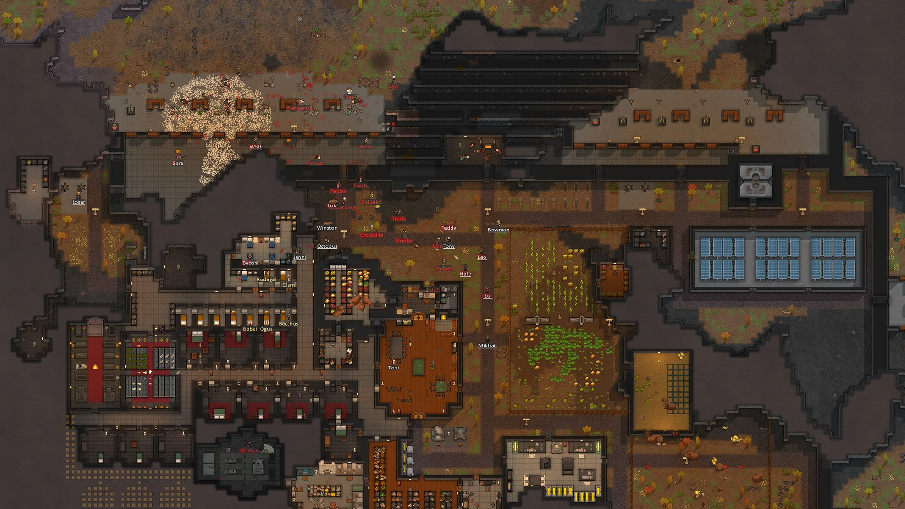
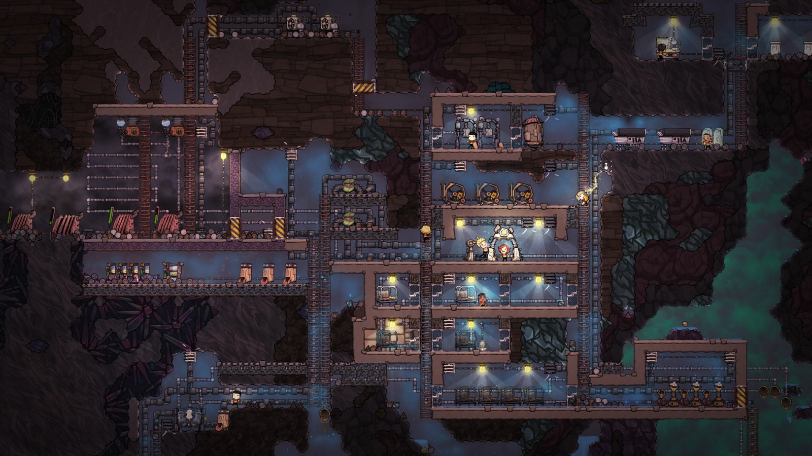
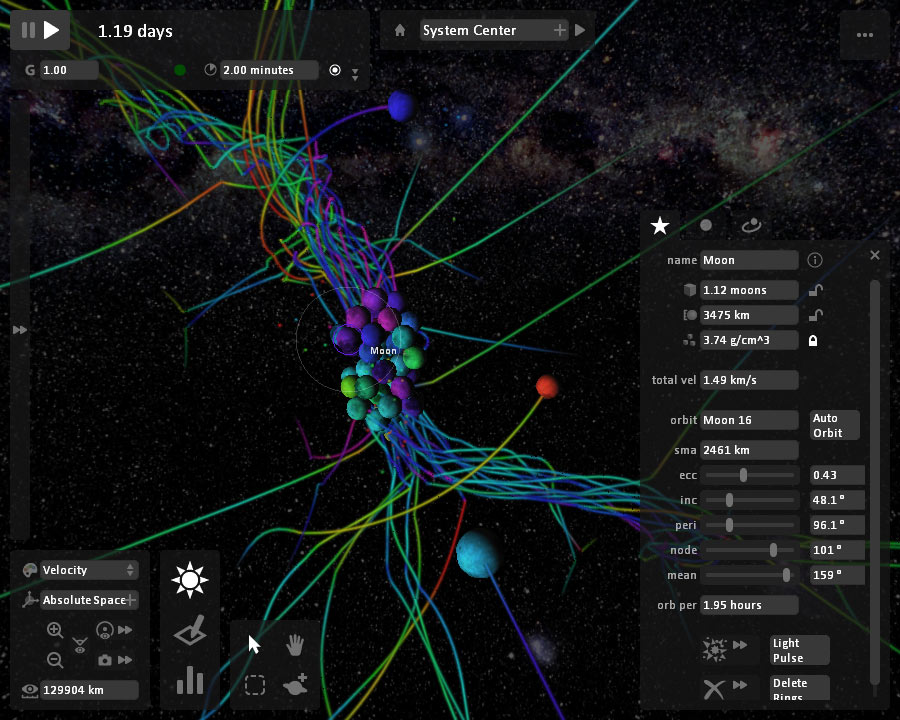
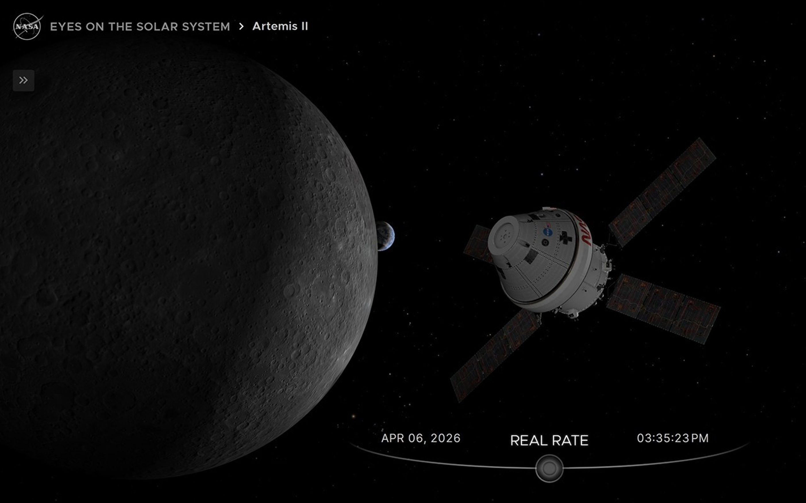
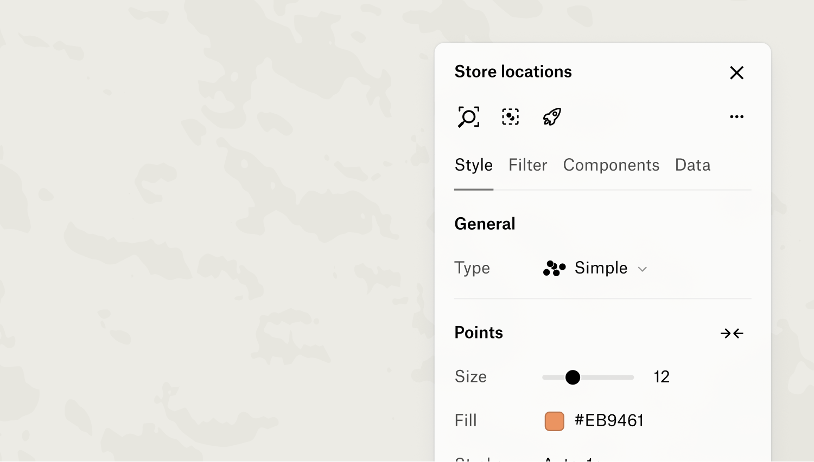
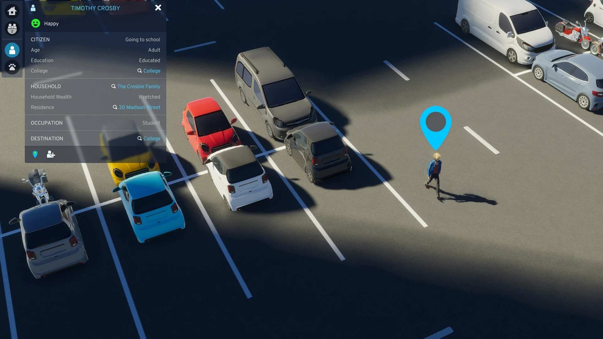

# Living-world UI references — 2026-09-09

Status: research input, not product authority.

These screenshots were downloaded from official product/help sites for private design research. They remain third-party copyrighted material unless their source says otherwise. Do **not** ship them as World Substrate assets, branding, or derivative artwork. Preserve the source URL when moving or replacing any image.

## Why these references

World Substrate should read as a place where a simulation is happening, not as an analysis dashboard describing a simulation. The useful common pattern across these references is **large world canvas first; controls and inspection stay peripheral, contextual, and dismissible**.

### RimWorld — world state is the interface

Source: <https://rimworldgame.com/images/screens/rimworld-colony.jpg>  
Product: <https://rimworldgame.com/>

Borrow: spatial continuity; many agents remain legible because they live in the world rather than a roster; rooms, resources, hazards, and work are recognizable by position and appearance.  
Avoid: copying its art style or reproducing its dense strategy HUD.

### Oxygen Not Included — consequence is visible in the environment

Source: <https://assets.klei.com/f/259446/1600x900/c03bceb078/base.jpg>  
Product: <https://www.klei.com/games/oxygen-not-included>

Borrow: a cutaway/plan-view world where people, infrastructure, activities, and resource problems are simultaneously visible; simulation state changes the scene itself.  
Avoid: turning every World Substrate domain into a literal construction game.

### Universe Sandbox — contextual inspector, world remains visible

Source: <https://universesandbox.com/screenshots/universesandbox-moonsandv2controls.jpg>  
Product: <https://universesandbox.com/>

Borrow: selected-object properties float at the edge while the simulation still dominates; transport/time controls are compact; motion trails are transient evidence of dynamics.  
Avoid: permanently visible technical parameter panels for ordinary viewing.

### NASA Eyes — time is a first-class simulation control

Source: <https://assets.science.nasa.gov/dynamicimage/assets/science/cds/eyes/common/promotion/Artemis2.jpg>  
Product: <https://science.nasa.gov/eyes/>

Borrow: nearly full-screen world, a calm identity breadcrumb, and a bottom time control that clearly belongs to the simulation rather than an analytics timeline.  
Avoid: requiring photorealism or 3D for World Substrate v1.

### Felt — inspection is hidden until selection

Source page: <https://help.felt.com/getting-started/tour-the-interface>  
Image: official Felt help-center `inspector.png` asset.

Borrow: the map/world is primary; the detail panel opens only after selecting something and can be dismissed; editing/inspection modes do not permanently consume the canvas.  
Avoid: GIS/editor chrome on the default simulation-watching path.

### Cities: Skylines II — selected resident + world context

Source: <https://images.ctfassets.net/u73tyf0fa8v1/4FE2lgSMsPmFefSxqT7OK8/31a623aaef486dfb14ff60174b06b4d0/5-CSII-Screenshot-UI-Citizen-rescale.webp>  
Product: <https://www.paradoxinteractive.com/games/cities-skylines-ii/about>

Borrow: click a resident, highlight them in-world, and show a bounded inspector with identity/current activity/relationships while preserving the surrounding world.  
Avoid: a permanently open citizen database or global metrics dashboard.

## Synthesis for World Substrate

The next Waltzman UI should feel closer to a small simulation game than a control room:

1. **World canvas gets 80–90% of attention.** Coordination Hall should be a coherent spatial place, not rows of status cards.
2. **Residents become embodied actors.** Give each resident a persistent in-world position/sprite/token. They move to briefing points, other residents, the meeting table, or intervention objects when retained events call for it.
3. **Resources become world objects/stations.** Validation capacity, clinical staffing, reserve, safeguard record, and package should live at recognizable places. Values/meters can appear on hover/selection or briefly when they change.
4. **Meeting is a visible activity.** Residents physically gather around a central table/zone while the canonical activity is active, then disperse after completion.
5. **Communication is transient.** Animate a short path/pulse and compact speech/message cue from source to recipient. Do not leave a permanent graph edge behind.
6. **Time lives on the bottom edge.** Play/pause/step plus the event-boundary scrubber should become one compact simulation transport bar. The current tick/event can be a small label above it.
7. **Branching is a history control, not a dashboard tab.** Baseline/Intervention can sit as a small history/fork selector near the transport bar or top corner. Switching selects a retained history; it never rewrites the scene.
8. **Inspector is secondary and selection-driven.** Clicking a resident, resource, activity, message, or institution opens a dismissible right-side sheet (desktop) / bottom sheet (mobile). This is where canonical details, “what do they know?”, and eventually causal evidence belong.
9. **Cybernetic analysis is another disclosure level.** “Explain / evidence” from the inspector may open deeper causal/graph tooling. It should never be the default visual surface.
10. **State color supports form instead of replacing it.** Blocked/conditional/ready should change posture, halo, station state, object state, or local atmosphere in addition to color. Avoid a wall of red/green cards.

## Waltzman composition target

A useful v2 composition is a shallow-isometric or top-down **Coordination Hall**:

- six residents around the room at persistent home/work positions;
- a central coalition meeting table;
- four prerequisite stations around the perimeter;
- an intervention/package arrival point;
- short movement paths between residents and stations;
- transient communication arcs/bubbles;
- the coalition gate represented as a central shared object/state, not an analytics card;
- compact bottom transport and branch controls;
- no graph/table visible until the viewer explicitly asks to inspect/explain.

Hard acceptance remains: **hide every graph, table, trace ID, and analysis panel; the result must still unmistakably look and behave like a living simulated world.**
